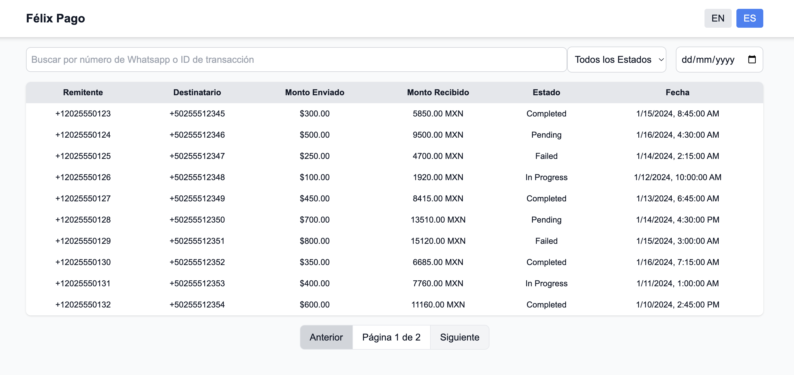

# Felix Remittance Dashboard

Welcome to the Felix Remittance Dashboard! This project is a feature-rich, responsive, and user-friendly web application designed to display and manage remittance transaction data.

---

## Features

- **Design Patterns**: Utilized the Provider pattern for efficient state and context management, and the Container-Presenter pattern to separate logic from UI rendering.
- **Working Software**: Core functionalities such as viewing, searching, and filtering remittance transactions.
- **Responsive Design**: Adaptive layouts for desktop (table view) and mobile (card view).
- **Internationalization**: English and Spanish language support.
- **Clean Code**: Modular, reusable, and maintainable codebase written in TypeScript.
- **Code Style**: Configured with ESLint and Prettier for consistent formatting.
- **Testing**: Unit and integration tests for critical components using Jest and React Testing Library.
- **Component Architecture**: Scalable and reusable components like `TransactionList`, `TransactionItem`, and `Pagination`.
- **Professional UI**: User-friendly and polished interface designed with Tailwind CSS.
- **Accessibility**: Added ARIA labels and improved usability.
- **Pagination**: Support for navigating large datasets efficiently.
- **Creativity**: Subtle hover effects and UI enhancements for better user experience.

---

## Screenshot




---

## Tech Stack

- **Framework**: Next.js (App Directory)
- **Styling**: Tailwind CSS
- **Type Checking**: TypeScript
- **State Management**: React Context
- **Internationalization**: Custom implementation using JSON files
- **Testing**: Jest and React Testing Library
- **API**: Custom API routes in Next.js

---

## Installation

1. Clone the repository:
   ```bash
   git clone https://github.com/AhuiVargas/felix-remittance-dashboard-next.git
   cd felix-remittance-dashboard
   ```

2. Install dependencies:
   ```bash
   npm install
   # or
   yarn install
   ```

3. Run the development server:
   ```bash
   npm run dev
   # or
   yarn dev
   ```

4. Open your browser and navigate to:
   ```
   http://localhost:3000
   ```

---

## Testing

Run the test suite using the following command:
```bash
npm test
# or
yarn test
```

